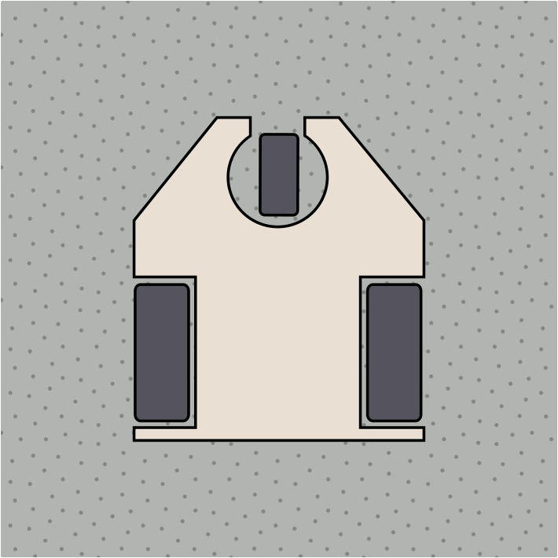
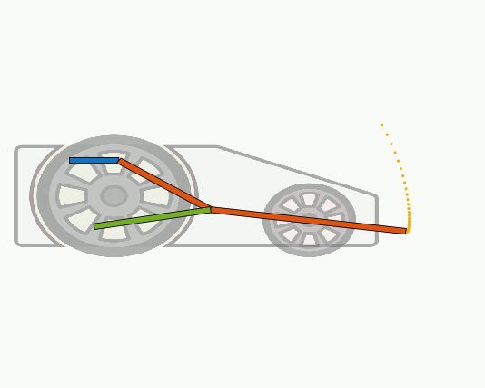
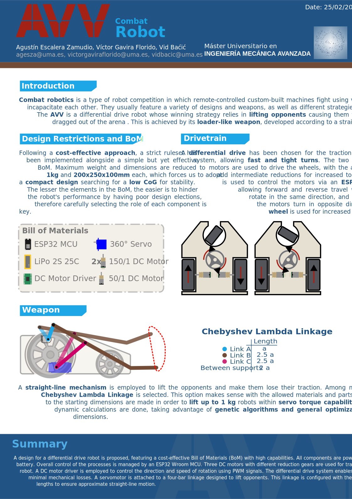
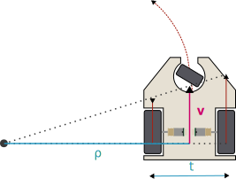
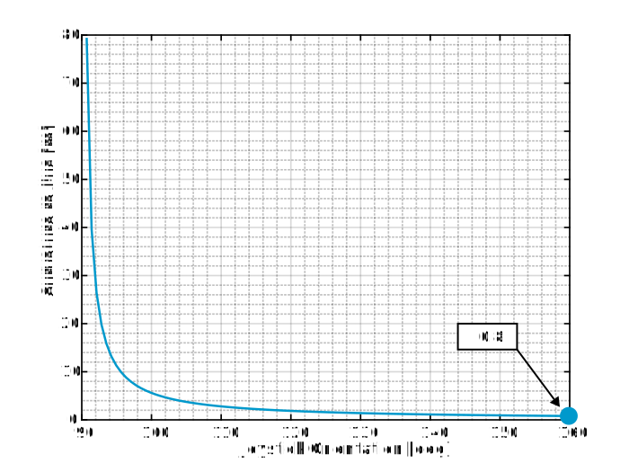
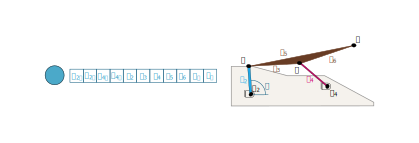

=======================
👨🏻‍🎓 Grupo AVV
=======================
Equipo formado por Agustín Escalera Zamudio, Víctor Gavira Florido y Vid Baćić.

Concepto
=======================

Las batallas de robots son un tipo de competición en la cual robots dirigidos por control remoto luchan usando distintas estrategias para incapacitarse. Suele destacar la gran variedad de diseños y armas, siendo la premisa principal la de construir un robot con el menor número de debilidades posible. Nuestro robot, denominado AVV, cuenta con un sistema de tracción diferencial y un arma que emula la pala de una excavadora. Siguiendo la estrategia de levantar a los enemigos, forzándolos a perder tracción y expulsarlos del octágono. 

*Especificaciones de diseño*
-----------------------------------------
 
Para maximizar la creatividad y minimizar costes, el inventario otorgado a cada equipo es particularmente pequeño. Cabe destacar que, cuanto menor sea el inventario, más fácil es perjudicar el rendimiento del robot si se toman malas decisiones en términos de diseño. Esto fuerza a los equipos a perfeccionar cada aspecto del robot para tener un rendimiento eficiente.

Además, con tal de facilitar aun más la igualdad, los robots se rigen en base a un extenso reglamento, que limita las dimensiones máximas a 200x250x100mm y el peso a 1kg. Fruto de esto, hemos optado por un diseño compacto, con tal de tener un bajo centro de gravedad y estabilidad decente.

*Sistema de tracción*
---------------------------------------

Se ha optado por un **sistema de tracción diferencial**, disponiendo de dos ruedas de tracción y una tercera rueda loca para aportar estabilidad. Las ruedas tractoras se accionarán con los dos **motores de reducción 150:1**, uno para cada rueda, con la posibilidad de añadir reducciones intermedias para aumentar el par motor. 
Cuando ambos motores giren a la misma velocidad y en el mismo sentido el robot podrá avanzar en línea recta, mientras que al reducir la velocidad de giro de uno de los motores permitirá que el robot trace una curva alrededor de un punto exterior. En caso de que ambos motores giren a la misma velocidad pero en sentidos opuestos, el robot girará alrededor de si mismo. Los motores se alimentarán con la batería LiPo, y su velocidad y sentido de giro se controlarán mediante **señales PWM enviadas desde el ESP32**.

*Concepto del arma*
---------------------------------
El arma del robot busca elevar a los oponentes durante el combate, tratando de desestabilizarlos o hacer que pierdan la tracción. Para ello, se pueden recurrir a diversos mecanismos, normalmente, basados en inversiones cinemáticas de mecanismos básicas como el mecanismo de 4 barras o el biela manivela. En este caso, debido a las limitaciones de materiales por normativa, y por la experiencia del grupo en la fabricación con PLA, se opta por eliminar todas las deslizaderas existentes. 

La apuesta del grupo AVV es el mecanismo de 4 barras conocido como **Chebyshev Lambda**. Este mecanismo aproxima un **movimiento rectilineo** mediante el movimiento rotativo de uno de los eslabones. Este último, se consigue mediante la conexión de uno de los eslabones con el **servomotor S3003**. Gracias al uso de este motor, contamos con un par elevado, suficiente para elevar a oponentes de hasta 1 kg. 

Este mecanismo cuenta con unas proporciones establecidas entre sus eslabones, las cuales se usarán como punto de partida. Sin embargo, el propósito del grupo es implementar algoritmos genéticos para optimizar características del mecanismo tales como:

* Cumplir con restricciones de espacio (evitar colisiones con elementos circundantes, reducir altura total, etc.)
* Minimizar la pérdida de carga en las ruedas tractoras.
* Minimizar el par ejercido por el servomotor.

*Póster resumen*
---------------------------------
El siguiente poster recoge de manera resumida los principales aspectos del robot de combate.

Diseño detalle
=======================

*Cinemática del robot*
---------------------------------
Tal y como se comentó en el concepto inicial, el robot cuenta con una tracción de tipo **"differential drive"**. Para poder manejar con comodidad un robot con esta tracción, es necesario realizar un estudio cinemático del mismo. Este estudio se apoya principalmente en la aplicación del concepto de Centro Instantáneo de Rotación, y permite calcular las velocidades perimetrales en cada rueda con el objetivo de mover el robot a una determinada velocidad, cumpliendo un radio de curvatura deseado. Las expresiones para determinar las velocidades en cada rueda son:

.. math::

   V_L = \frac{v}{\rho}(\rho - \frac{t}{2}) \\
   V_R = \frac{v}{\rho}(\rho + \frac{t}{2})

La siguiente figura permite entender estos conceptos de manera visual:

Sin embargo, como vemos es necesario definir un radio de curvatura :math:`\rho`. Este vendrá dado por los inputs de nuestro control, que se realiza en la aplicación **Dabble**. Esta app permite mandar consignas al microprocesador, a través de una interfaz muy amigable que cuenta con distintos controles: joysticks, botones, etc. En nuestro caso, se relaciona el radio del joystick con una velocidad, mientras que la orientación del mismo está asociada al radio de curvatura. Los radios de curvatura menores se asocian a ángulos más cercanos a la horizontal, mientras que los mayores se asocian a la vertical. La siguiente función relaciona en nuestro caso el radio de curvatura con la orientación del joystick, en grados:

Esta función viene dada por la siguiente expresión:

.. math::

   \rho = \frac{56}{Joystick_{deg}-90}

Aplicando los conceptos anteriores, se puede simular el comportamiento del robot ante una entrada determinada. Las siguientes animaciones son un ejemplo de ello. Esta simulación se ha desarrollado en MATLAB.

.. raw:: html

   

       
       
   

*Optimización del mecanismo*
---------------------------------
La principal limitación del **mecanismo Lambda de Chebyshev** es que para mantener la rectitud de la trayectoria **los eslabones deben mantener una relación específica** entre ellos. Por ello, la trayectoria del mecanismo solo puede desplazarse fuera del chasis del robot si se incrementa el tamaño de los eslabones o si se desplaza todo el mecanismo hacia adelante. En el primer caso, se violarían las restricciones de tamaño de la competición, y en el segundo caso se incrementa el riesgo de que el robot vuelque al intentar levantar el adversario. Debido a lo anterior, se ha optado por modificar el mecanismo teniendo en cuenta cuatro objetivos principales:

* Cumplir con las restricciones de tamaño impuestas.
* Hacer que el mecanismo siga la trayectoria deseada.
* Minimizar el par ejercido por el servomotor.
* Evitar el vuelco del robot.

Para alcanzar dichos objetivos, se puede jugar con las **longitudes de los eslabones**, la **posición de los puntos fijos O2 y O4** y las **distancias AB y BC**. 

Debido a la interacción entre los objetivos y entre las variables, se ha decidido utilizar un algoritmo genético de evolución diferencial. Para ello, es necesario definir una población de individuos, todos con un grupo definido de variables a optimizar consideradas "genes". En este caso, las variables a optimizar serán las descritas previamente, además del ángulo inicial y final del recorrido del mecanismo.

Con ello, cada individuo de la población será un mecanismo con una configuración única, que se resolverá tanto para posición como para fuerzas en el recorrido angular definido del eslabón motor. A partir de dichas soluciones, será posible evaluar lo bien que cumple el mecanismo los objetivos buscados. Para ello, es necesario definir una función de coste que, al evaluar un individuo, devuelva un error, que en definitiva indica que tan bien cumple dicho inidviduo los objetivos.

.. math::
   error = \sqrt(k_c\cdot e_c^2 + k_d\cdot e_d^2)	

Pruebas
=======================