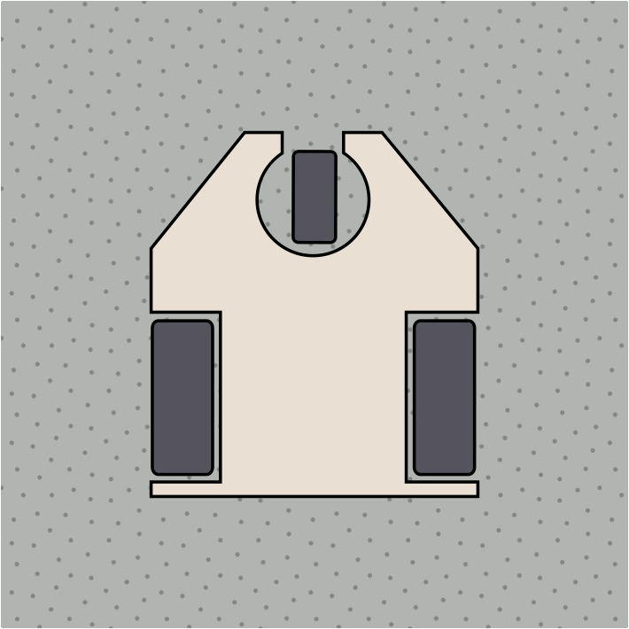

=======================
👨🏻‍🎓 Grupo AVV
=======================
Equipo formado por Agustín Escalera Zamudio, Víctor Gavira Florido y Vid Baćić.

Concepto
=======================

*Especificaciones de diseño*
-----------------------------------------
En este apartado se recogen las restricciones de diseño así como la lista de los materiales disponibles para construir el robot.

*Sistema de tracción*
---------------------------------------

Se ha optado por un **sistema de tracción diferencial**, disponiendo de dos ruedas de tracción y una tercera rueda loca para aportar estabilidad. Las ruedas tractoras se accionarán con los dos **motores de reducción 150:1**, uno para cada rueda, con la posibilidad de añadir reducciones intermedias para aumentar el par motor. Cuando ambos motores giren a la misma velocidad y en el mismo sentido el robot podrá avanzar en línea recta, mientras que al reducir la velocidad de giro de uno de los motores permitirá que el robot trace una curva alrededor de un punto exterior. En caso de que ambos motores giren a la misma velocidad pero en sentidos opùestos, el robot girará alrededor de si mismo. Los motores se alimentarán con la batería LiPo, y su velocidad y sentido de giro se controlarán mediante **señales PWM enviadas desde el ESP32**.

Concepto del arma
---------------------------------

Diseño detalle
=======================
...

Pruebas
=======================